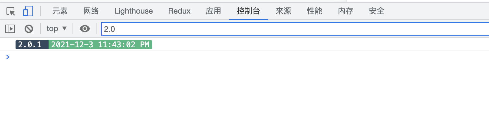

# webpack-version-plugin

控制台打印当前构建版本号和构建时间



## 使用说明
```
  npm i -D webpack-version-plugin
```
3. 修改配置文件，以`nuxt.config.js`为例
```javascript
// nuxt.config.js
const VersionPlugin = require('webpack-version-plugin')

export default {
  build: {
    plugins: [new VersionPlugin()]
  }
}
```